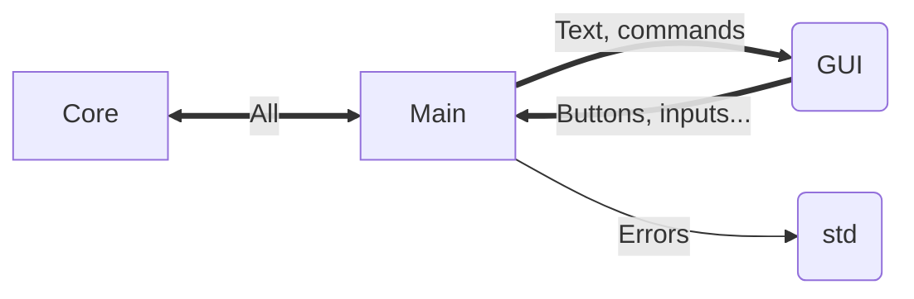

# How it's work?

The `core` folder contain the terminal.
The `graphics` folder contain the GUI.

Schema:

```mermaid
flowchart LR

A[Main] ==>   |Text, commands| B
B(GUI)  ==>   |Buttons, inputs...| A
A       -->   |Errors| D(std)
C[Core] <===> |All| A
```
