# How does it work?

The `core` folder contain the terminal.  
The `graphics` folder contain the GUI.

Schema:


The `Main` part

```mermaid
classDiagram

File --> sget
sget --* SnabbGET : to replace
sget --|> rw
rw --* Raw_mode : to replace
SnabbGET --|> Raw_mode
SnabbGET --|> CLI
SnabbGET --|> SYNTAX
SnabbGET --|> CMDS
SnabbGET : SnabbGET()
SnabbGET : init()
SnabbGET : read_input()
SnabbGET : new_line()
SnabbGET : one_line
SnabbGET : userName
SnabbGET : computerName
SnabbGET : currentDir
Raw_mode : Raw_mode()
Raw_mode : pause()
Raw_mode : resume()
Raw_mode : enum KEY_ACTIO
CMDS : CMDS()
CMDS : #define EXIT 0
CMDS : #define HELP 1
CMDS : #define ... ...
CMDS : _exit_()
CMDS : _help_()
CMDS : _..._()
CLI : popup()
CLI : list()
CLI : table()
SYNTAX : 🦺 In dev
```



For the moment, the GUI is `std` (CLI).

**You can also use the command-line version.**

```sh
$ <SnabbGET file path> say hello
> hello
```


See `syntax.ebnf` for syntax details.
